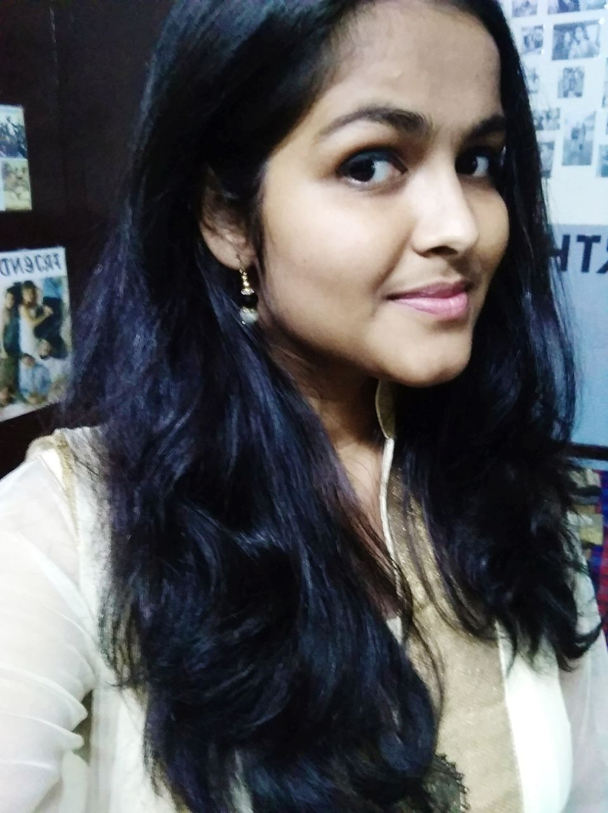
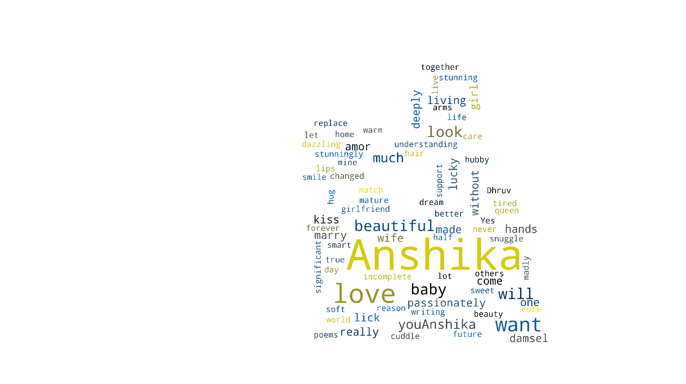

There is a difference between pretty and beautiful:

Pretty - Attractive without truly being beautiful

For example -

This is pretty, but not beautiful

> Beautiful - There is a lot of jibber-jabber in the dictionary. But in one word, it is **you**

Factually, this is our second Valentine's. Romantically, the first.

I don't have a poem this time amor; Writing them a lot of times makes them to lose their essence.
But there are a lot of things I have gifted you during our beautiful relationship over time:

- My heart
- A Graphical 'I love u' in Python
- A shell script to post our quotes
- This:

That image seems a little small. Anyways, you know what it means for me.
this time, we also have something more: scroll down as you read!
Language is highlighted in the brackets

For ease of reading, all the text has been written in the English alphabet

1.  Ana Behibek (Arabic)
2.	Te Dua (Albanian)
3.	Men Seni severam (Azerbaijanian)
4.	Asko maite zatut (Basque)
5.	Obicham te(Bulgarian)
6.	Ngo oi ney(Cantonese)
7.	Wo ai ni(Mandarin)
8.	Volim te(Croatian)
9.	Mi amas vin(Esperanto)
10.	Miluji te(Czech)
11.	Jeg elsker dig(Danish)
12.	Aharen Kalaa Dhekeh Loabivey(Dhivehi)
13.	Ik hou van jou(Dutch)
14.	Tora dust midaram(Persian)
15.	Mina rakastan sinua(Finnish)
16.	S'agapo(Greek)
17.	Me shen mikhvarkar(Georgian)
18.	Ina sonki(Hausa)
19.	Aloha wau ia 'oe(Hawaiian)
20.	Szeretlek te'ged(Hungarian)
21.	Naan unnai kadalikeren(Tamil)
22.	meh chi chain maai(Kashmiri)
23.	Tangsinul sarangha yo(Korean)
24.	Men seni syuem(Kyrgyz)
25.	nkwagala(Buganda)
26.	Kocham cię(Polish)
27.	Te iubesc(Romanian)
28.	Mama oyata adarei(Sinhalese)
29.	Naku penda(Kiswahili)
30.	Seni seviyourm(Turkish)
31.	Ikh hob dikh lib(Yiddish)
32.	Ich liebe dich(German)
33.	T'estimo(Catalan)
34.	Afgreki' (Ethiopian)
35.	Kuv hlub koj(Hmong)
36.	Aishiteru(Japanese)
37.	Inhobbok(Maltese)
38.	Lu'bim ta(Slovak)
39.	Ya tebe kahayu(Ukrainian)
40.	Mo ni fe(Yoruba)
41.	Ninapenda wewe(Swahili)
42.	Njan Ninne Premikunnu(Malayalam)
43.	Ami tomake bhalo bhashi(Bengali)
44.	Aku terno kowe(Javanese)
45.	Men seny jaksy kuremyn(Kazakh)
46.	Ta gra agram ort(Gaelic)
47.	Yes kez sirumen(Armenian)
48.	Te amo(Spanish)
49.	Es tevi miluu(Latvian)
50.	Ani ohev otach(Hebrew)
51.	Naanu ninna preetisuttene(Kannada)
52.	Mu tumaku bhala paye(Odia)
53.	Te sakam(Macedonian)
54.	Waan ku jeclahay(Somali)
55.	Minjo tere naal pyaar hega(Dogri)
56.	Nenu ninnu premistunnanu(Telugu)
57.	ya lyublyu tebya(Russian)
58.	Saya sayang awak(Malay)
59.	anh yêu em(Vietnamese)
60.	Iniibig kita(Tagalog)
61.	Ndinokuda(Shona)
62.	Ndagukunda(Kirundi)
63.	Kuyayki(Quechua)
64.	Ngiyakuthanda(Zulu)
65.	Tiako ianao(Malagasy)
66.	Mi yidi ma(Fula)
67.	Men seni sevaman(Uzbek)
68.	'Rwy'n dy garu(Welsh)
69.	Mi timilai maya garchhu(Nepali)
70.	Taim i'ngra leat(Irish)
71.	Mi aime jou(Creole)
72.	Tu magel moga cho(Konkani)
73.	Moi tumak val pao(Assamese)
74.	Je t'aime(French)
75.	Eg elska tigg(Icelandic)		
76.	Saya cinta padamu(Indonesian)
77.	Phom rak khun(Thai)
78.	Ti amo(Italian)
79.	Ndiyakuthanda(Xhosa)
80.	Ne mohotatse(Cheyenne)
81.	Negligevapse(Inuit)
82.	Tave myliu(Lithuanian)
83.	Ana moajaba bik(Moroccan)
84.	Ma tokhe pyar kendo ahyan(Sindhi) 
85.	Eg elski teg(Faroese)
86.	Ma armastan sind(Estonian)
87.	Ni mits neki(Nahuatl)
88.	Ke a go rata(Setswana)
89.	Techihhila(Sioux)
90.	Ua Here Vau la Oe(Tahitian)
91.	U kamakutu nu(Comanche)
92.	Ik hald fan dy(Frisian)
93.	Mi ta stimabo(Papiamento)
94.	Män sızni söyümän(Uyghur)
95.	Eu te amo(Portuguese)
96.	Ek het jou lief(Afrikaans)
97.	Hu tane prem karu chu(Gujarati)
98.	Main tumhe pyaar karta hu(Hindi)
99.	Mi tuzashi prem kartos(Marathi)
100.I love you(English)

Hope you liked it. :heart:
There are three more statements to follow this up Anshika

- **I love you and respect you**
- **I will marry you, no matter what**
- **I trust you**

Words and code cannot express my love for you baby. You are the most beautiful person I have ever come across. I love when you get angry 
that I don't take care of myself, when you get all lovey-dovey over me, when you smother me with your hugs.You are such a caring, kind-
hearted,loving, trustworthy,beautiful,cute,sweet girlfriend darling. Adjectives for you are endless. You never ever try to even think to 
hurt me.You love me the way I am and never try to change me. I seriously want to marry you baby. 
One question to finish this post baby:

## Anshika, will you be my Valentine?

~ Your Boyfriend :heart:
